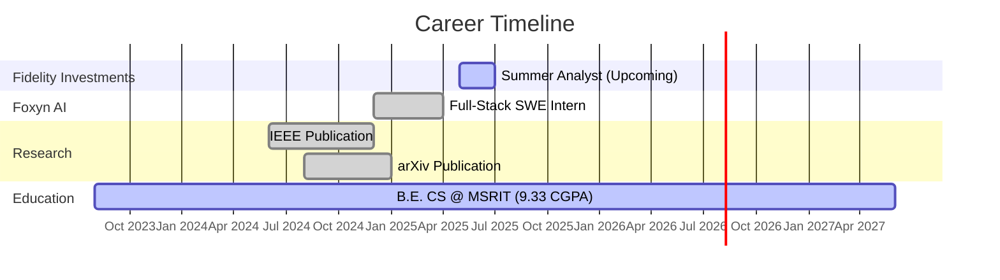
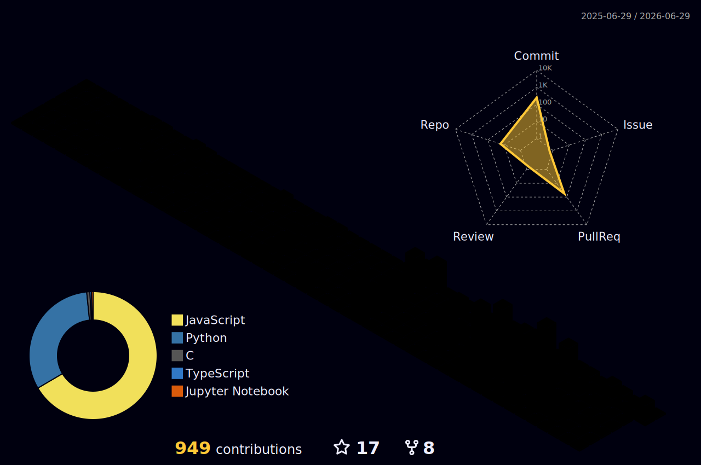

<div align="center">

# 🚀 Welcome to My Digital Universe


<br/>

<a href="https://linkedin.com/in/gauravmishraokok"></a>
<a href="https://leetcode.com/gauravmishraokok"></a>
<a href="mailto:gauravmishraokok@gmail.com"></a>
<a href="https://github.com/gauravmishraokok"></a>

<br/><br/>

<picture>
  <source media="(prefers-color-scheme: dark)" srcset="https://capsule-render.vercel.app/api?type=venom&color=6366F1&height=200&section=header&text=&fontSize=0&animation=twinkling">
  
</picture>

</div>

---

<div align="center">

```
┌─────────────────────────────────────────────────────────────────────────────┐
│                                                                             │
│   ██████╗  █████╗ ██╗   ██╗██████╗  █████╗ ██╗   ██╗                      │
│  ██╔════╝ ██╔══██╗██║   ██║██╔══██╗██╔══██╗██║   ██║                      │
│  ██║  ███╗███████║██║   ██║██████╔╝███████║██║   ██║                      │
│  ██║   ██║██╔══██║██║   ██║██╔══██╗██╔══██║╚██╗ ██╔╝                      │
│  ╚██████╔╝██║  ██║╚██████╔╝██║  ██║██║  ██║ ╚████╔╝                       │
│   ╚═════╝ ╚═╝  ╚═╝ ╚═════╝ ╚═╝  ╚═╝╚═╝  ╚═╝  ╚═══╝                       │
│                                                                             │
│              M I S H R A    ·    E N G I N E E R    ·    B U I L D E R     │
│                                                                             │
└─────────────────────────────────────────────────────────────────────────────┘
```

</div>

---

##  About Me


> *Building intelligent systems that bridge the gap between cutting-edge AI and real-world impact*

I'm a **Computer Science Engineer** passionate about creating scalable software solutions and pushing the boundaries of artificial intelligence. Currently incoming **Summer Analyst at Fidelity Investments** and previously architected full-stack systems at **Foxyn AI** — all while pursuing my B.E. at **M.S. Ramaiah Institute of Technology** with a **9.33 CGPA**.

```javascript
const gaurav = {
    location: "Bangalore, India 🇮🇳",
    role: "Software Engineer | AI Researcher",
    education: "B.E. Computer Science (Expected 2027)",
    currentFocus: [
        "Full-Stack Development",
        "Machine Learning",
        "System Design"
    ],
    achievements: {
        hackathons: [
            "🥈 SIH 2025 Grand Finalist (2nd/500+)",
            "🌍 Top 50 Globally - IBM TechXchange",
            "🥈 Code Carnage National (2nd/300+)"
        ],
        publications: [
            "IEEE - Optimization Techniques",
            "arXiv - LLM Thematic Analysis"
        ],
        impact: "100K+ records/month | Ministry of Education"
    },
    funFact: "I turn caffeine into production-ready code ☕"
};
```

<br clear="right"/>

---

## 💼 Professional Journey

<div align="center">



</div>

<br/>

<table>
<tr>
<td width="50%" valign="top">

<div align="center">

###  Fidelity Investments

**Summer Analyst**
*May 2025 - July 2025 | Bangalore*

</div>

<br/>

```
╔══════════════════════════════════════╗
║  🏦  FIDELITY INVESTMENTS           ║
║  ──────────────────────────────────  ║
║  Role: Summer Analyst                ║
║  Duration: May - July 2025          ║
║  Status: ⏳ Incoming                 ║
║                                      ║
║  Focus Areas:                        ║
║  ├─ Financial Technology             ║
║  ├─ Software Engineering             ║
║  └─ Enterprise Systems               ║
╚══════════════════════════════════════╝
```

</td>
<td width="50%" valign="top">

<div align="center">

###  Foxyn AI

**Software Engineering Intern — Full-Stack**
*Dec 2024 - April 2025 | Bangalore*

</div>

<br/>

- 🏗️ Architected secure ERP & data digitization systems processing **100K+ bilingual records/month**
- ⚡ Eliminated **60% of manual processing bottlenecks** through RESTful API design
- 🚀 Delivered full-stack portals with **~99.3% uptime** and **40% faster turnaround**
- 💰 Drove **5-8% revenue margin increase** for government clients
- 🔐 Implemented role-based access control & audit logging

</td>
</tr>
</table>

---

## 🛠️ Tech Arsenal

<div align="center">


<br/><br/>

<table>
<tr>
<td align="center" width="25%">

**⚡ Languages**

</td>
<td align="center" width="25%">

**🎨 Frontend & Backend**

</td>
<td align="center" width="25%">

**🧠 AI/ML & Data**

</td>
<td align="center" width="25%">

**☁️ DevOps & Cloud**

</td>
</tr>
<tr>
<td align="center">

`C++` `Python` `JavaScript`
`Java` `C` `R` `SQL`

</td>
<td align="center">

`React` `Node.js` `Express`
`TailwindCSS` `REST APIs`

</td>
<td align="center">

`PyTorch` `TensorFlow`
`scikit-learn` `🤗 Transformers`
`BERTopic` `Pinecone`

</td>
<td align="center">

`Docker` `Nginx` `MongoDB`
`MySQL` `Git` `Linux`
`Elasticsearch`

</td>
</tr>
</table>

</div>

<br/>

<div align="center">

```
                    ┌──────────────────────────────────────────────┐
                    │          PROFICIENCY MATRIX                   │
                    ├──────────────────────────────────────────────┤
                    │                                              │
                    │  C++ / Python      ████████████████████ 95%  │
                    │  JavaScript        ██████████████████░░ 90%  │
                    │  React / Node.js   ██████████████████░░ 88%  │
                    │  PyTorch / TF      ████████████████░░░░ 85%  │
                    │  System Design     ████████████████░░░░ 82%  │
                    │  Docker / DevOps   ██████████████░░░░░░ 78%  │
                    │  Java              ██████████████░░░░░░ 75%  │
                    │                                              │
                    └──────────────────────────────────────────────┘
```

</div>

---

## 🏆 Featured Projects

<div align="center">


</div>

<table>
<tr>
<td width="50%" valign="top">

<div align="center">

### 🧠 DataSutra — Decision Intelligence Engine

[](https://github.com/gauravmishraokok)

</div>

```
┌────────────────────────────────────┐
│  🏛️  Deployed by Ministry of       │
│     Education, Govt. of India      │
│  🥈  2nd Place — SIH 2025         │
│     (500+ teams nationally)        │
└────────────────────────────────────┘
```

**Stack:** `Python` `React` `MongoDB` `Pinecone` `Elasticsearch`

- 📄 Automated analysis of **10,000+ policy documents**
- 🎯 **35%+ accuracy boost** with Self-Rewarding LLM architecture
- ⚡ **99.5% time reduction** — 4+ hours → <60 seconds
- 🔍 Explainable AI with verifiable citation mapping
- 🏗️ RAG pipeline with hybrid semantic + keyword search

</td>
<td width="50%" valign="top">

<div align="center">

### 💰 ZeroDa — AI-Powered Expense Tracker

[](https://github.com/gauravmishraokok) [](https://github.com/gauravmishraokok)

</div>

```
┌────────────────────────────────────┐
│  🤖  NLP-Powered Auto-Parsing     │
│  📊  AI Budget Forecasting        │
│  ⚡  Bulk Sync — 50 txns/click    │
└────────────────────────────────────┘
```

**Stack:** `MERN` `NLP` `Gemini API` `TailwindCSS`

- 🎯 **98% categorization accuracy** with automated UPI/SMS parsing
- 📈 **25% improvement** in budget management via AI forecasting
- ⚡ **99.7% reduction** in manual entry through bulk sync
- 🔔 Smart alerts & spending pattern recognition

</td>
</tr>
<tr>
<td width="50%" valign="top">

<div align="center">

### 📊 Topic Modeling & LLM Evaluation

[](https://github.com/gauravmishraokok) [](https://arxiv.org/abs/2510.07557)

</div>

```
┌────────────────────────────────────┐
│  📚  Published on arXiv            │
│  🔬  1M+ Prompts Analyzed         │
│  📏  15+ Semantic Categories       │
└────────────────────────────────────┘
```

**Stack:** `BERTopic` `MiniLM` `UMAP` `HDBSCAN` `Python`

- 🗂️ Clustered **1M+ prompts** for LLM performance benchmarking
- 📝 Published peer-reviewed research on RLHF methodologies
- 📊 Established evaluation metrics for **15+ semantic categories**
- 🔄 Novel pipeline for unsupervised thematic analysis

</td>
<td width="50%" valign="top">

<div align="center">

### 🏥 VaidyaCare — Healthcare Platform

[](https://github.com/gauravmishraokok)

</div>

```
┌────────────────────────────────────┐
│  🥈  2nd Place — Code Carnage     │
│     (300+ teams nationally)        │
│  ⏱️  Built in < 24 Hours          │
└────────────────────────────────────┘
```

**Stack:** `MERN` `WebRTC` `Socket.io` `TailwindCSS`

- 🏆 National hackathon winner — built under extreme time pressure
- 📹 Integrated telemedicine with real-time video consultations
- 💊 Health monitoring dashboard with vitals tracking
- 💬 Real-time patient-doctor communication system

</td>
</tr>
</table>

<div align="center">

```
╔═══════════════════════════════════════════════════════════════════════════════════╗
║                                                                                   ║
║    📊 CUMULATIVE PROJECT IMPACT                                                   ║
║    ─────────────────────────────                                                  ║
║                                                                                   ║
║    🔹 10,000+ Policy Documents Analyzed    🔹 100K+ Records Processed/Month      ║
║    🔹 99.5% Time Reduction Achieved        🔹 35%+ Accuracy Improvements          ║
║    🔹 3 National Hackathon Wins            🔹 2 Research Publications              ║
║    🔹 Deployed by Government of India      🔹 1M+ Data Points Clustered           ║
║                                                                                   ║
╚═══════════════════════════════════════════════════════════════════════════════════╝
```

</div>

---

## 📊 GitHub Analytics

<div align="center">


<br/>


</div>

### 🔥 Contribution Heatmap

<div align="center">


</div>

### 📈 3D Contribution Graph

<div align="center">

> **⚙️ Setup Required:** To enable the 3D contribution graph below, add the [GitHub Profile 3D Contrib](https://github.com/yoshi389111/github-profile-3d-contrib) GitHub Action to your repository. Create `.github/workflows/profile-3d.yml` with the workflow from that repo, then the image below will auto-generate.



</div>

<details>
<summary><b>🔧 Click to see GitHub Action setup for 3D Contribution Graph</b></summary>

Create `.github/workflows/profile-3d.yml` in your profile repository:

```yaml
name: GitHub-Profile-3D-Contrib

on:
  schedule:
    - cron: "0 18 * * *"  # Runs daily at midnight IST
  workflow_dispatch:

jobs:
  build:
    runs-on: ubuntu-latest
    name: generate-github-profile-3d-contrib
    steps:
      - uses: actions/checkout@v4
      - uses: yoshi389111/github-profile-3d-contrib@0.7.1
        env:
          GITHUB_TOKEN: ${{ secrets.GITHUB_TOKEN }}
          USERNAME: gauravmishraokok
      - name: Commit & Push
        run: |
          git config user.name github-actions
          git config user.email github-actions@github.com
          git add -A .
          git diff --quiet && git diff --staged --quiet || (git commit -m "generated 3d contrib" && git push)
```

This will generate multiple themes in `./profile-3d-contrib/` — use `profile-night-rainbow.svg` for the best look with this README theme.

</details>

<br/>

<div align="center">


</div>

---

## 🧩 LeetCode Statistics

<div align="center">


</div>

---

## 🎖️ Achievements & Recognition

<div align="center">

```
    ╔══════════════════════════════════════════════════════════════════════════╗
    ║                        🏆  HALL OF ACHIEVEMENTS  🏆                     ║
    ╠══════════════════════════════════════════════════════════════════════════╣
    ║                                                                          ║
    ║   🥈 SIH 2025 Grand Finalist                                           ║
    ║      └─ 2nd out of 500+ teams · Deployed by Ministry of Education       ║
    ║                                                                          ║
    ║   🌍 IBM TechXchange Hackathon                                          ║
    ║      └─ Top 50 Globally · Won IBM conference ticket to USA              ║
    ║                                                                          ║
    ║   🥈 Code Carnage National Hackathon                                    ║
    ║      └─ 2nd out of 300+ teams · Built VaidyaCare in <24 hours           ║
    ║                                                                          ║
    ║   🥉 Axiom State Hackathon                                              ║
    ║      └─ 3rd out of 100+ teams · Anti-phishing detection system          ║
    ║                                                                          ║
    ║   📊 Amazon ML Challenge                                                ║
    ║      └─ Ranked 947 / 24,000+ teams in real-world ML competition         ║
    ║                                                                          ║
    ║   📚 2 Research Publications (IEEE + arXiv)                             ║
    ║      └─ Co-authored papers on optimization & LLM thematic analysis      ║
    ║                                                                          ║
    ╚══════════════════════════════════════════════════════════════════════════╝
```

</div>

---

## 📝 Research & Publications

<table>
<tr>
<td width="50%" valign="top">

<div align="center">

### 📄 IEEE Conference Paper

[](https://ieeexplore.ieee.org/document/10985323)

</div>

<br/>

**Optimization Techniques in Electronics: Advances, Challenges, and Future Directions**

*Co-author* · Published 2024

```
📌 Key Contributions:
├─ Survey of cutting-edge optimization
│  methodologies in electronics
├─ Comparative analysis of modern
│  vs classical approaches
└─ Practical application frameworks
   for industry adoption
```

</td>
<td width="50%" valign="top">

<div align="center">

### 📄 arXiv Research Paper

[](https://arxiv.org/abs/2510.07557)

</div>

<br/>

**Investigating Thematic Patterns and User Preferences in LLM Interactions using BERTopic**

*Co-author* · Published 2024

```
📌 Key Contributions:
├─ Novel unsupervised topic modeling
│  pipeline for LLM alignment
├─ Analysis of 1M+ user prompts
│  across 15+ semantic categories
└─ Insights for RLHF and
   preference optimization
```

</td>
</tr>
</table>

---

## 💡 Philosophy & Vision

<div align="center">

```
    ┌─────────────────────────────────────────────────────────────────────────┐
    │                                                                         │
    │    "I don't just write code — I architect solutions that matter.        │
    │                                                                         │
    │     Every project is an opportunity to blend elegant engineering        │
    │     with tangible impact, whether it's processing 100K+ records        │
    │     for government systems or reducing policy review time by 99.5%.    │
    │                                                                         │
    │     My passion lies at the intersection of AI, full-stack              │
    │     development, and system design — creating intelligent systems      │
    │     that solve real-world problems at scale."                          │
    │                                                                         │
    │                                              — Gaurav Mishra           │
    │                                                                         │
    └─────────────────────────────────────────────────────────────────────────┘
```

</div>

<br/>

<table>
<tr>
<td width="33%" align="center" valign="top">

```
    ┌──────────────┐
    │   🤖  AI/ML  │
    │  INNOVATION  │
    └──────┬───────┘
           │
    ┌──────┴───────┐
    │ Self-Rewarding│
    │ LLMs · RAG   │
    │ Systems ·    │
    │ Intelligent  │
    │ Automation   │
    └──────────────┘
```

</td>
<td width="33%" align="center" valign="top">

```
    ┌──────────────┐
    │  🏗️ SYSTEM   │
    │ ARCHITECTURE │
    └──────┬───────┘
           │
    ┌──────┴───────┐
    │ Scalable     │
    │ Distributed  │
    │ Systems ·    │
    │ 100K+ TPS ·  │
    │ 99%+ Uptime  │
    └──────────────┘
```

</td>
<td width="33%" align="center" valign="top">

```
    ┌──────────────┐
    │  🚀 REAL     │
    │ WORLD IMPACT │
    └──────┬───────┘
           │
    ┌──────┴───────┐
    │ 60-99% Work  │
    │ Reduction ·  │
    │ Government   │
    │ Adoption ·   │
    │ Published    │
    └──────────────┘
```

</td>
</tr>
</table>

---

## 📬 Let's Connect & Collaborate

<div align="center">

```
╔═══════════════════════════════════════════════════════════════╗
║                                                               ║
║   💼  OPEN TO OPPORTUNITIES IN:                               ║
║                                                               ║
║   ▸ Full-Stack Development    ▸ Machine Learning Engineering  ║
║   ▸ AI Research               ▸ System Design                 ║
║   ▸ Software Engineering      ▸ Backend Engineering           ║
║                                                               ║
╚═══════════════════════════════════════════════════════════════╝
```

<br/>

<a href="https://linkedin.com/in/gauravmishraokok"></a>
<a href="mailto:gauravmishraokok@gmail.com"></a>
<a href="https://leetcode.com/gauravmishraokok"></a>
<a href="tel:+918762349500"></a>

<br/><br/>

### 💬 Let's build something extraordinary together!

<br/>


</div>

---

<div align="center">


<br/>

### ⭐ If you find my work interesting, consider giving my repositories a ⭐ and let's connect!

<br/>

**`💻 Built with passion, deployed with purpose | 2025 © Gaurav Mishra`**


</div>
