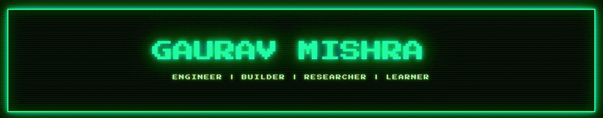
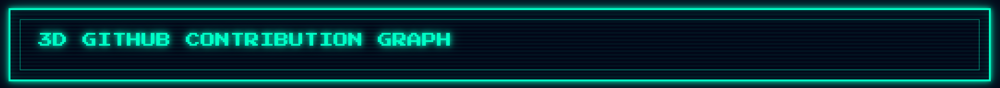
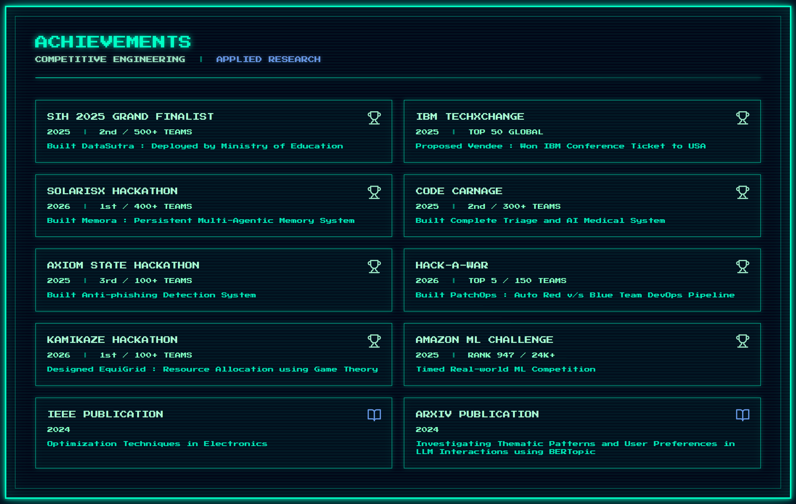
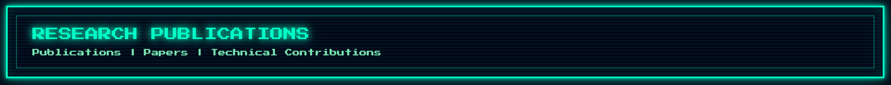
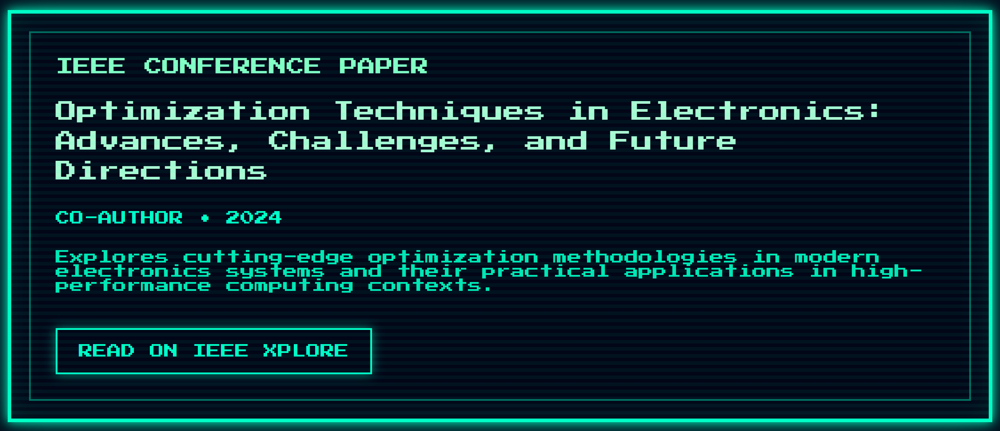
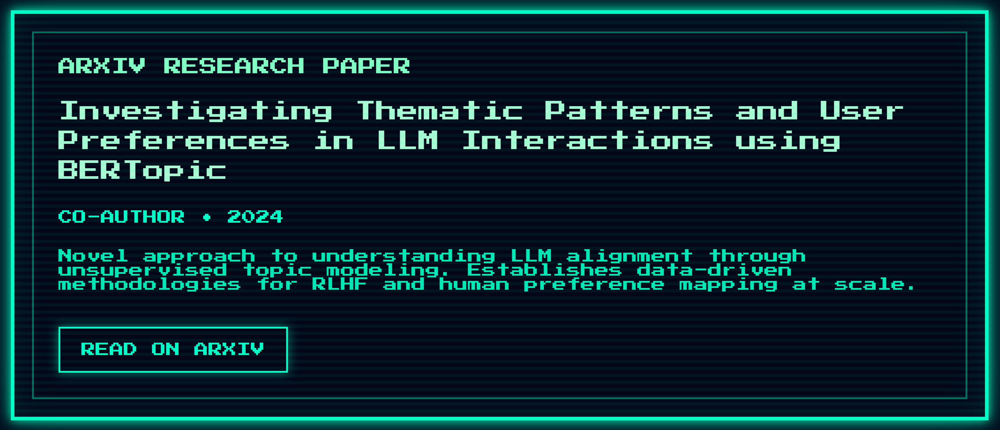
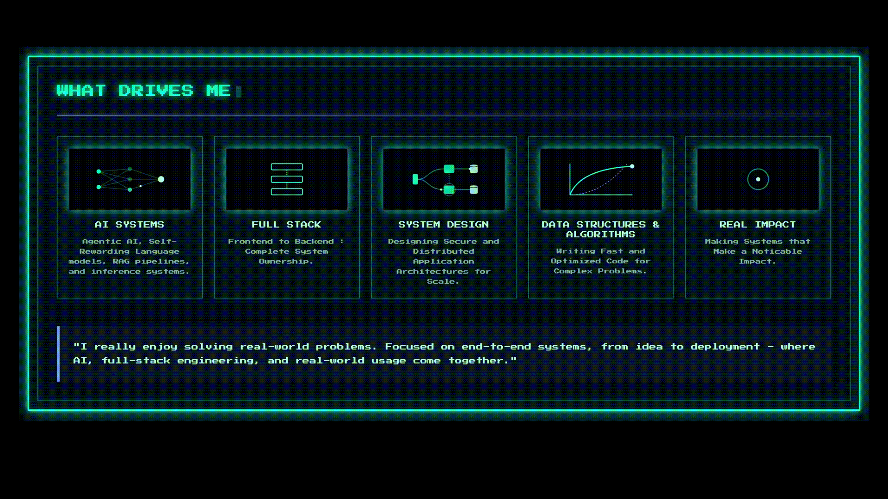
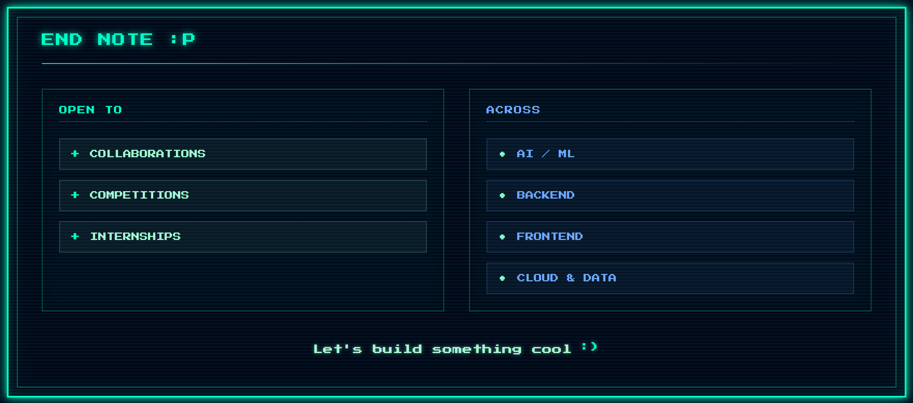

<!-- ======================= HERO BANNER ======================= -->

 

<!-- ======================= SOCIAL LINKS ======================= -->

  
  
  
  

<!-- ======================= ABOUT ME ======================= -->

<!-- ======================= WORK EXPERIENCE ======================= -->

<!-- ======================= TECHNICAL SKILLS ======================= -->

<!-- ======================= PROJECTS ======================= -->

<!-- ======================= GITHUB ACTIVITY ======================= -->

  <!-- HEADER -->
  

  <!-- GRAPH -->
  

<!-- ======================= LEETCODE STATS ======================= -->

  

<!-- ======================= ACHIEVEMENTS ======================= -->

<!-- ======================= RESEARCH ======================= -->

  

  
  

<!-- ======================= WHAT DRIVES ME ======================= -->

  

<!-- ======================= END NOTE ======================= -->

  

