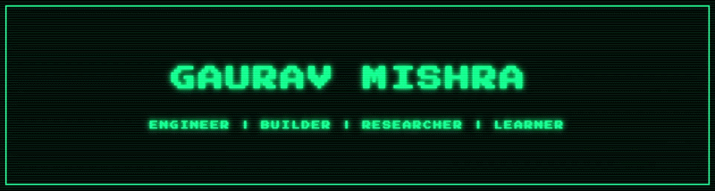
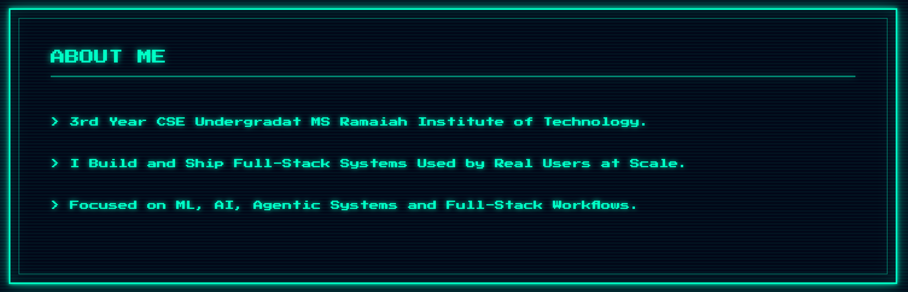
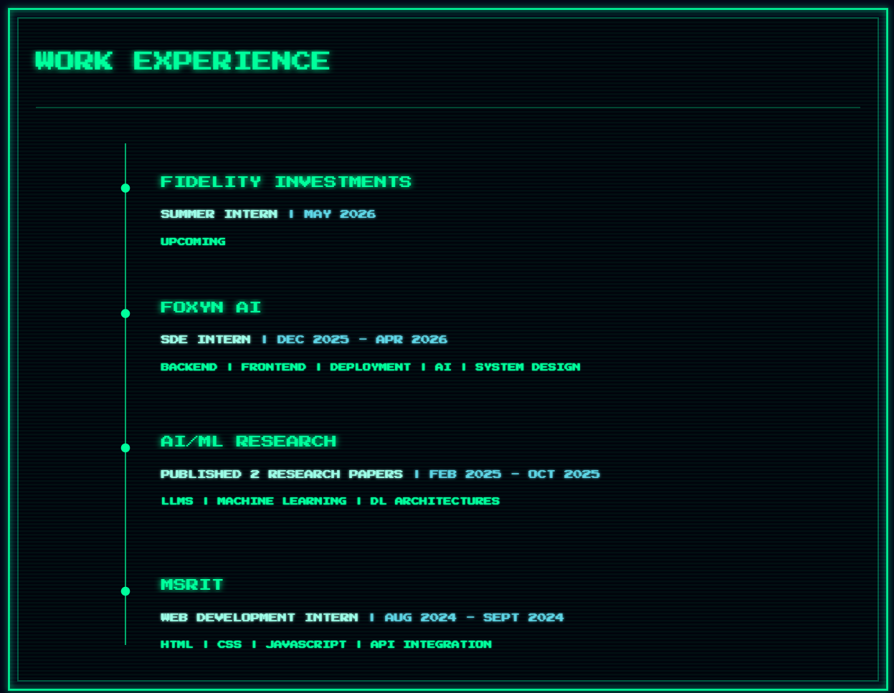
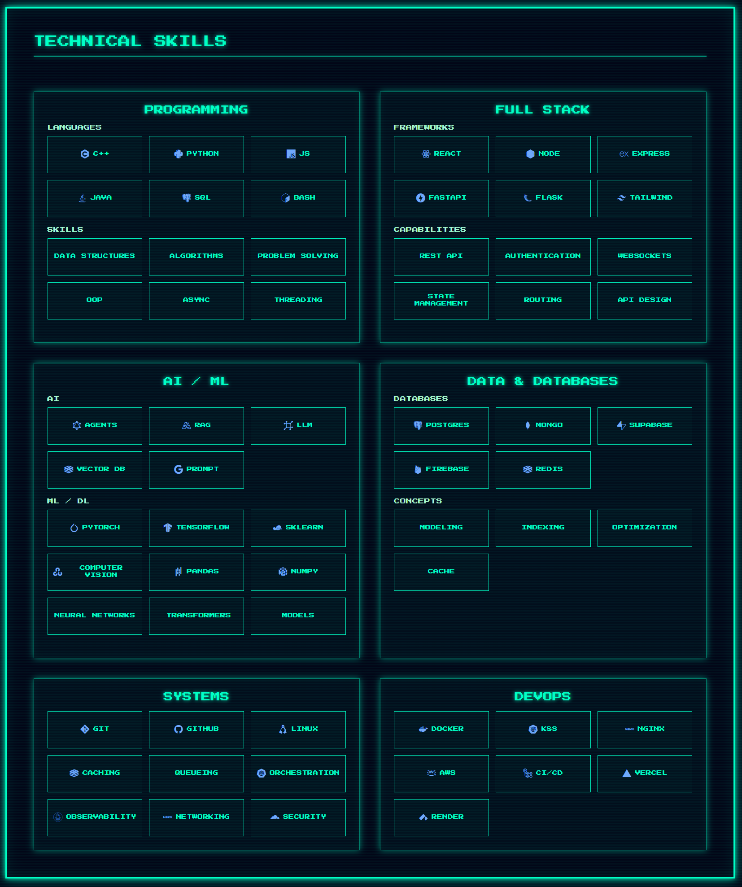
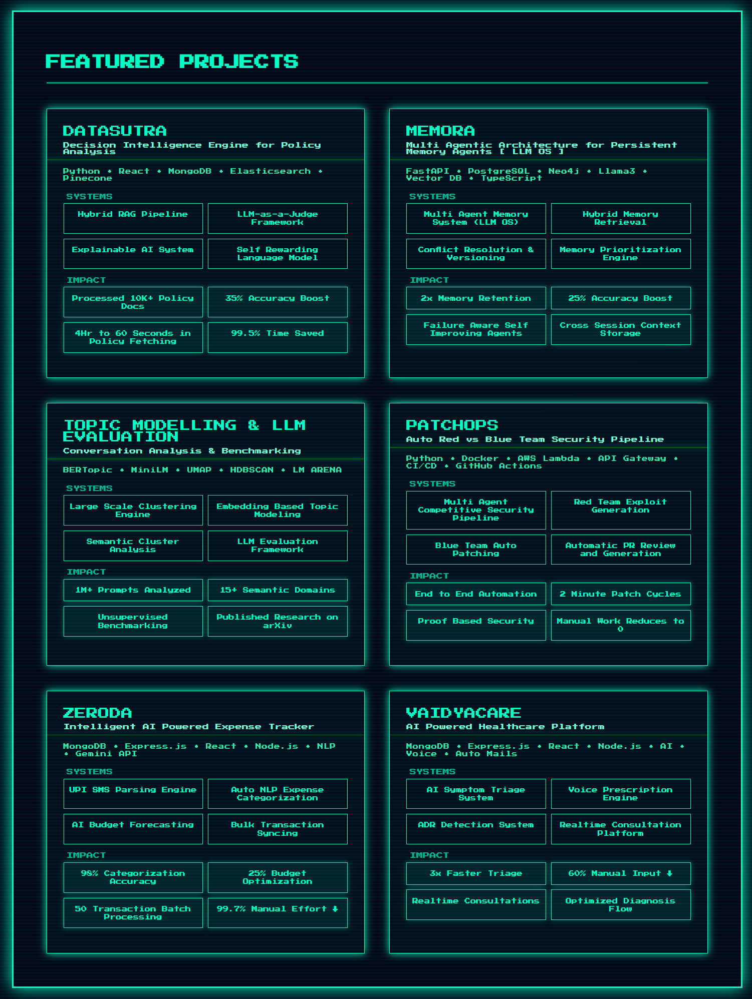

<br/>


<br/><br/>
<br/><br/>

<p align="center">
  <a href="https://linkedin.com/in/gauravmishraokok">
    
  </a>
  <a href="https://leetcode.com/gauravmishraokok">
    
  </a>
  <a href="mailto:gauravmishraokok@gmail.com">
    
  </a>
  <a href="https://github.com/gauravmishraokok">
    
  </a>
</p>
</div>

<br>



</div>




</div>




</div>



</div>

## 🌐 3D Contribution Graph

<div align="center">


</div>

</div>

## 🧩 LeetCode Statistics

<div align="center">


</div>

</div>

## 🎖️ Achievements & Recognition

<div align="center">

| 🏆 Achievement | 📅 Year | 🎯 Result |
|:---|:---:|:---|
| **SIH 2025 Grand Finalist** | 2025 | 🥈 **2nd / 500+ teams** · Deployed by Ministry of Education |
| **IBM TechXchange Hackathon** | 2025 | 🌍 **Top 50 Globally** · Won IBM conference ticket to USA |
| **SolarisX Hackathon** | 2026 | 🥇 **1st / 400+ teams** · Built Memora — agent memory system |
| **Code Carnage, National** | 2025 | 🥈 **2nd / 300+ teams** · Built VaidyaCare in < 24 hours |
| **Axiom, State Hackathon** | 2025 | 🥉 **3rd / 100+ teams** · Anti-phishing detection system |
| **Hack-A-War Hackathon** | 2026 | 🎯 **Top 5 / 150 teams** · Built PatchOps |
| **Kamikaze Hackathon** | 2026 | 🥇 **1st / 100+ teams** |
| **Amazon ML Challenge 2025** | 2025 | 📊 **Ranked 947 / 24,000+ teams** · Real-world ML competition |
| **IEEE Publication** | 2024 | 📚 Co-authored: Optimization Techniques in Electronics |
| **arXiv Publication** | 2024 | 🔬 Co-authored: LLM Thematic Analysis with BERTopic |

</div>

---

## 📝 Research & Publications

<table>
<tr>
<td width="50%" valign="top">

### 📄 IEEE Conference Paper

**Optimization Techniques in Electronics: Advances, Challenges, and Future Directions**

*Co-author* · Published 2024

Explores cutting-edge optimization methodologies in modern electronics systems and their practical applications in high-performance computing contexts.

<br/>

[](https://ieeexplore.ieee.org/document/10985323)

</td>
<td width="50%" valign="top">

### 📄 arXiv Research Paper

**Investigating Thematic Patterns and User Preferences in LLM Interactions using BERTopic**

*Co-author* · Published 2024

Novel approach to understanding LLM alignment through unsupervised topic modeling. Establishes data-driven methodologies for RLHF and human preference mapping at scale.

<br/>

[](https://arxiv.org/abs/2510.07557)

</td>
</tr>
</table>

---

## 💡 What Drives Me

<div align="center">


</div>

<br/>

<table>
<tr>
<td width="20%" align="center" valign="top">

<br/>

```
  ██████
 ██ AI ██
  ██████
    ██
  ██████
```

**🤖 AI Systems**

Building self-rewarding models and RAG pipelines that exceed human-labelled baselines.

</td>
<td width="20%" align="center" valign="top">

<br/>

```
 ┌──┐ ┌──┐
 │FE│→│BE│
 └──┘ └──┘
    ↓
  [DB]
```

**🏗️ Full-Stack**

End-to-end ownership — from pixel-perfect UI to distributed backend systems at scale.

</td>
<td width="20%" align="center" valign="top">

<br/>

```
 [svc]──[svc]
   ╲     ╱
  [gateway]
     │
  [99.3%]
```

**⚙️ System Design**

Architecting distributed systems that handle 100K+ transactions with 99%+ uptime.

</td>
<td width="20%" align="center" valign="top">

<br/>

```
  O(n²) →
  O(n log n) →
  O(n) →
  O(log n) ✓
```

**🧩 DSA**

Competitive programming mindset applied to real engineering tradeoffs and interviews.

</td>
<td width="20%" align="center" valign="top">

<br/>

```
  problem
    ↓
  shipped
    ↓
  impact
    ↓
  repeat
```

**🚀 Real Impact**

Code that reduces manual work by 60–99% and gets adopted — not just demonstrated.

</td>
</tr>
</table>

<br/>

<div align="center">

> *"I don't just write code — I architect solutions that matter. Every project is a chance to blend elegant engineering with tangible impact: processing 100K+ records for government systems, cutting policy review from hours to seconds, or building an entire healthcare platform overnight. My work lives at the intersection of AI, full-stack systems, and real-world deployment."*

</div>

<br/>

---

## 📬 Let's Connect & Collaborate

<div align="center">

### Open to opportunities in:
**Full-Stack Development** &nbsp;·&nbsp; **Machine Learning Engineering** &nbsp;·&nbsp; **AI Research** &nbsp;·&nbsp; **System Design**

<br/>

[](https://linkedin.com/in/gauravmishraokok)
[](mailto:gauravmishraokok@gmail.com)
[](https://leetcode.com/gauravmishraokok)
[](tel:+918762349500)

<br/>


</div>
